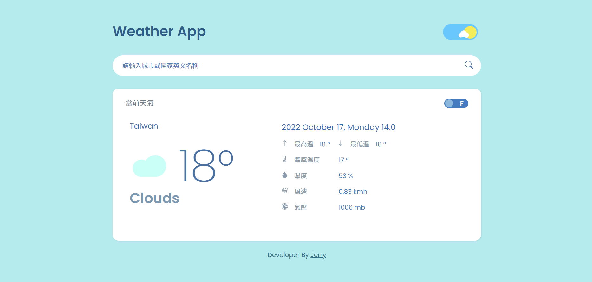

# OpenWeather Web APP

## Description

This is a simple and responsive Weather web app built using HTML, CSS and Javascript. It uses[OpenWeatherMap API](https://openweathermap.org/) to fetch temperature, weather, location, humidity & wind speed details.Moreover, user can use day-night toggle button to switch background color and other styles.

## Build with 

- `HTML5`
- use Sass/SCSS of CSS preprocessor to handle `CSS3`
- `Javascript`
- Responsive by `@media` Media Queries for mobile, tablet, laptop ( use [Bootstrap5](https://getbootstrap.com/) )
- OpenWeatherMap API
- Javascript's popup boxes - `SweetAlert2`
## Features

- User can use day-night toggle button to switch background color and other styles
- User can only enter **English country name** or **city name**
- User input error will pop up reminder window with [SweetAlert2](https://sweetalert2.github.io/)
- Showing the Weather details such as weather, temperature, location, max-temp, min-temp, feel-like-temp, humidity, wind speed and air pressure.
- User can use temperature unit switch button to show Celsius or Fahrenheit temperature

## Links

Here are the relevant links that I browsed :

- [[30apis] Day 1 : OpenWeatherMap](https://ithelp.ithome.com.tw/articles/10192206)
- [React-weather-app](https://github.com/esnz/react-weather-app)
- [Day/Night Switch](https://codepen.io/fagnanm/pen/RpWNyb)
- [Weather icon](https://www.iconfinder.com/iconsets/the-weather-is-nice-today)